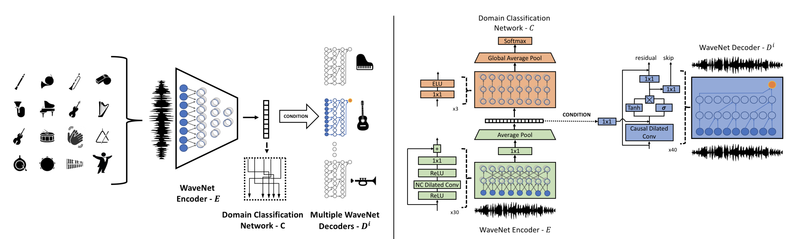

# Music Translation
PyTorch implementation of the method described in the [A Universal Music Translation Network](https://arxiv.org/abs/1805.07848).

<p align="center"></p>

We present a method for translating music across musical instruments and styles. 
This  method is based on unsupervised  training of a multi-domain wavenet autoencoder, with a shared encoder and a 
domain-independent latent space that is trained end-to-end on waveforms.


This repository includes [fast-inference kernels written by nvidia](https://github.com/NVIDIA/nv-wavenet). The kernels 
were modified to match our architecture as detailed in the paper.

## Quick Links
- [Samples](https://musictranslation.github.io/)
- [Setup](#setup)
- [Training](#training)
- [Inference](#training)

## Setup

### Software
Requirements: 
* Linux
* Python 3.7
* PyTorch v1.0.1
* Install python packages
    ```
    git clone https://github.com/facebookresearch/music-translation.git
    cd music-translation
    pip install -r requirements.txt
    ```
* Install fast inference wavenet kernels (requires Tesla V100 GPU):
    ```
    cd src/nv-wavenet
    python setup.py install
    ```

### Data

1. Download MusicNet dataset from [here](https://homes.cs.washington.edu/~thickstn/musicnet.html) into ```musicnet``` folder.
2. Extract specific domains from MusicNet dataset: 
   ```
   python src/parse_musicnet.py -i musicnet -o musicnet/parsed
   ```
3. Split into train/test/val 
    ```
    for d in musicnet/parsed/*/ ; do python src/split_dir.py -i $d -o musicnet/split/$(basename "$d"); done
    ```
4. Preprocess audio for training
    ```
    python src/preprocess.py -i musicnet/split -o musicnet/preprocessed
    ```

### Pretrained Models

Pretrained models are available [here](https://dl.fbaipublicfiles.com/music-translation/pretrained_musicnet.zip).

## Training

We provide training instructions for both single node and multi-node training. 
Our results were achieved following 3 days of training on 6 nodes, each with 8 gpus. 

### Single Node Training

Execute the train script:
```
./train.sh
```

Trained models will be saved in the ``checkpoints/musicnet`` directory.

### Multi-Node Training

To train in Multi-Node training, use the follow the instructions below. NOTE: Multi-Node training requires a single node per dataset. 

Execute the train script (on each node):
```
train_dist.sh <nnodes> <node_rank> <master_address>
```
The parameters are as follows:
```
<nnodes>            - Number of nodes participating in the training.
<node_rank>         - The rank of the current node.
<master_address>    - Address of the master node.
```

## Inference

We provide both interactive/offline generation scripts based on [nv-wavenet CUDA kernels](https://github.com/NVIDIA/nv-wavenet):
1. ``notebooks/Generate.ipynb`` - interactive generation.   
2. ``sample.sh <checkpiont name> "<decoders ids>"`` - samples short segments of audio from each dataset and converts to 
the domains the method was trained on. Running the script will create a ``result\DATE`` directory, with subfolder for 
each decoder. See ``src/run_on_files.py`` for more details.

In addition, we provide python-based generation:
1. ``sample_py.sh <checkpiont name> "<decoders ids>"`` - same as 2. above.


## License

You may find out more about the license [here](https://github.com/fairinternal/music-transfer/blob/music-oss/LICENSE).

## Citation
```
@inproceedings{musictranslation,
    title     = {A Universal Music Translation Network},
    author    = {Noam Mor, Lior Wold, Adam Polyak and Yaniv Taigman},
    booktitle = {International Conference on Learning Representations (ICLR)},
    year      = {2019},
}
```
